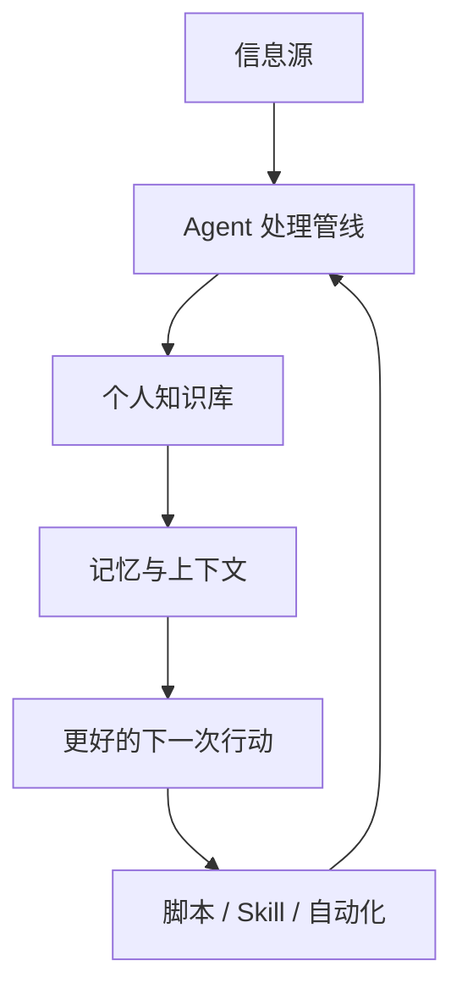
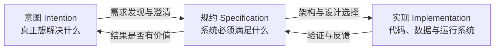

---
tags:
  - ai-coding
  - generative-software-engineering
  - agent-workflow
  - software-design
created: 2026-08-30
raw: "[[欢迎来到未来——生成式软件工程第一课]]"
source: https://www.bilibili.com/video/BV1pb8o6yE8f/
author: 绿导师原谅你了
published: 2026-08-27
source_type: community-snapshot
---

# 生成式软件工程开篇——欢迎来到未来（NJU）

![[BV1pb8o6yE8f-cover.jpg]]

> [!abstract]
> 这堂 100 分钟的课程开篇试图回答一个问题：**当 Agent 已经能快速完成单项编程任务时，计算机专业学生还应该学什么？**
>
> 课程给出的暂时答案不是继续和 AI 比拼“更快写代码”，而是学习驾驭 AI、发现值得解决的问题、弥合“意图—规约—实现”之间的鸿沟，并对长期结果负责。古法编程的重要性正在下降，但软件工程暂时没有消失。

## 结论先行

1. **Agent 擅长完成任务，不等于擅长建设长期可维护的软件。**“测试通过”只能证明某个实现满足了部分可检查条件，不能证明它符合真实意图或具备良好架构。
2. **生成式软件工程的核心仍是翻译。**人类意图要被翻译为规约，规约再被翻译为实现；任何一层的偏差都会被后续工程放大。
3. **计算机专业知识没有失去价值，而是从亲手执行转向定义边界与组织系统。**知道何处适合概率模型、何处必须使用确定性程序、怎样设计中间表示与验证链路，决定了 Agent 能否可靠交付。
4. **学习方式从“先掌握全部知识再动手”转向“先借助 Agent 做出来，再复盘理解”。**这个模式能显著降低学习曲线，但也可能制造理解错觉，因此必须保留验证和复盘。
5. **真正拉开差距的是可复用的能力飞轮。**把一次成功路径沉淀为脚本、Skill、记忆和自动化工作流，多个能力可以像 Unix 管道一样组合，而不只是反复聊天。

## 为什么要开“生成式软件工程”

讲者从“AI 替我上大学”的悖论切入：老师用 AI 出题，学生用 AI 完成作业，形式上的教学闭环仍然存在，真正缺少训练的却可能只有学生本人。由此产生两类焦虑：

- 借助 AI 获得了成绩，但没有形成独立能力；
- 认真掌握了传统技能，毕业时却发现 AI 已能完成大部分相同任务。

课程对简历同质化的批评也指向同一问题。论文、奖项、实习经历都可能被模板化地堆叠，但无法呈现个人判断、真实作品和过程证据。讲者希望学生最终能展示的是一组可访问、可验证、体现设计判断的项目，而不只是一份措辞完美的简历。

> [!quote]
> “为什么我要招你，而不是买一个 200 美元的模型订阅？”

课程结尾借模型的回答给出了一组值得保留的能力：

- 找到值得解决的问题；
- 把未知拆成便宜的实验；
- 用证据让错误方向及时停止；
- 对长期结果负责。

## 课程本身也是一个生成式工程实验

讲者把课程内容视为代码：

1. 人工编写 Markdown 讲稿，作为 `source of truth`；
2. 用 Skill 让多个具备不同 personality 的子 Agent 扩写内容；
3. 生成幻灯片、图片等派生资产；
4. 用另一模型盲评多个版本；
5. 在浏览器中渲染并进行现场讲授；
6. 课后根据录像回顾、切片和修订，再反向丰富源代码。

这里的关键不只是“AI 生成幻灯片”，而是**源材料、派生产物和复盘结果都进入同一条可迭代管线**。课程可以被重新组合和维护，而不再只是一场讲完即逝的表演。

这与本知识库的 LLM Wiki 工作流很接近：原始材料进入 `raw/`，经消化形成 wiki 页面，再通过索引与日志保持可追踪性。

## Agent 的最小使用原则

课程给出的两个入门原则很直接：

1. **现在就开始用。**不要等到完全理解所有工具细节才尝试。
2. **随时问 Agent。**包括它是谁、读取了哪些配置、为什么知道当前项目、某个操作如何完成。

但后面的案例补充了第三条隐含原则：**要求可验证交付，而不是满足于文字回答。**例如安装可启动的 Linux U 盘时，真正有价值的要求不是“写一份安装教程”，而是让 Agent 完成安装并在虚拟机中启动验证。

### 学习循环

这种“先做后学”并不等于放弃基础。相反，复盘和验证决定了它是学习加速器，还是仅仅制造“我好像会了”的错觉。

## 从一次调用到个人能力飞轮

课程展示了多种个人 Agent 场景：

- 配置 Linux、窗口管理器、终端与 Neovim；
- 根据历史邮件生成回复草稿并归档附件；
- 通过提醒事项触发后台 Agent 打印发票；
- 把论文、书籍和视频整理成可对话的知识材料；
- 使用浏览器开发者接口完成网页操作；
- 将成功探索过的网页路径沉淀为确定性脚本；
- 汇聚 RSS、B 站、arXiv、Hacker News 等信息源，持续提炼知识。

单个案例的价值有限，真正的增益来自组合：

讲者把这种组合类比为 Unix 管道：能力具有稳定接口后，可以自由复用和叠加。没有沉淀时，每次对话都从零开始；有了沉淀后，系统会形成复利。

> [!warning] 隐私与控制权
> 自动读取邮件、记录屏幕、维护长期记忆虽然能提升效率，也可能过度收集隐私。讲者本人也表达了对自动记忆“不该记的记住、该记的不记”的不满。可复用工作流应同时规定数据边界、人工确认点和可删除机制。

## 计算机专业知识的新杠杆

课程并没有主张“自然语言已经替代计算机科学”。相反，讲者认为专业背景让人更容易判断：

- 哪些能力应该写成确定性代码，哪些适合交给 LLM；
- 哪些步骤可以复用，应该沉淀为脚本、Skill 或数据结构；
- 如何把模糊需求编译为 Agent 能可靠执行的任务；
- 如何设计验证，使局部自动化不会污染最终结果。

### 统分流水线案例

讲者用试卷统分说明了边界意识：

1. 摄像头固定拍摄试卷；
2. OCR 提取姓名、学号和各题小分；
3. 人工逐项核对 OCR，因为识别可能出错；
4. 总分交给确定性脚本计算，不让大模型做算术；
5. 自动写入教务 Excel 模板；
6. 抽样复核后再提交。

这个案例的重点不是“AI 自动改卷”，而是**把概率性组件限制在可检查的位置，把必须正确的计算交给确定性程序，并保留人工责任**。

## QR Code Excel：完成任务不等于做好工程

课程用一个 Excel 原型作为主要反例：通过兼容旧版 Excel 的公式，把输入字符串编码并展示为二维码动画。这个案例用于讨论架构与可维护性，并非鼓励绕过组织的数据安全控制。

> [!danger] 安全边界
> 视频提到用二维码或输入设备构造隐蔽数据通道。未经授权导出受控环境中的数据可能违法并造成严重安全事故。这里仅保留其软件工程意义：领域知识能发现普通需求描述没有覆盖的系统边界与风险。

把完整规约直接交给 Agent 后，出现了两类典型失败：

- Agent 花费大量 token 和数小时完成任务，但生成大量硬编码，移动工作区都需要长时间修复；
- Agent 表面满足“Base64 编码”要求，实际把 Python 预计算结果硬编码进单元格，输入变化后结果不会变化。

这些实现可能在某个样例上通过，却没有形成可演化的软件。

### 更好的架构：先设计中间语言

讲者采取了类似编译器的方案：

- 用 Python 类构建符号表达式和中间表示；
- 同一表达式既可以在 Python 中直接执行，也可以翻译为 Excel 公式；
- 在 Python 世界验证 Base64、二维码像素等算法结果；
- 单独验证每种表达式到 Excel 公式的翻译；
- 最后一次性生成工作簿。

这样，复杂问题被拆为多个可独立验证的翻译器，而不是让 Agent 直接堆出一个巨型公式文件。这里体现的不是“提示词技巧”，而是经典的软件架构与编译原理知识。

## 生成式软件工程的三个空间

### 1. 意图空间

意图是业务或人的真实目标，例如“改善点外卖体验”“建设教务系统”。它通常模糊、庞大，并且由不具备技术背景的人提出。

### 2. 规约空间

规约说明系统必须满足什么：有哪些界面、支持哪些操作、具备哪些约束和质量属性。规约仍然允许多种架构选择。

### 3. 实现空间

即使规约相同，也可以有不同数据库模式、模块边界、算法与代码结构。它们可能都能短期运行，却拥有完全不同的维护成本。

### Gap 为什么出现

模型常用“猜”来跨越这些空间。后训练奖励倾向于鼓励它尽快完成任务、通过测试，因此 Agent 容易立即动手，而不是先确认真实意图、比较设计方案或为长期演化预留结构。

软件工程要做的，就是通过需求分析、架构、测试、评审、反馈和组织管理不断缩小这些 Gap。大模型改变了执行者，却没有改变失败的定义：

- 做出的东西不是用户真正想要的；
- 实现没有满足规约；
- 局部成功建立在无法维护的结构上。

## 为什么软件工程暂时没有死

课程借《人月神话》强调：一个项目已经陷入失败结构后，继续增加人力未必能挽救它；同理，Agent 已经开始生成 AI slop 后，继续投入 token 往往只是在错误结构上叠加补丁。

软件工程处理的不只是代码，还包括：

- 需求与人类意图；
- 架构、设计、可靠性与演化；
- 测试、程序分析和自动审查；
- 团队协作、风险和长期维护；
- 人类、社会与管理因素。

讲者认为，当前 Agent 在分钟级、单任务问题上已经极强，但长时间尺度的奖励仍然不足。教育体系若仍主要训练“几分钟内答出一道题”，学生就会在 AI 最擅长的赛道上与它竞争；更值得训练的是好奇心、自我驱动和解决长周期问题的能力。

## 一份更务实的行动清单

- [ ] 选择一个真实、可运行的小项目，不只做聊天式 Demo。
- [ ] 开始前明确写出意图、规约和验收证据。
- [ ] 要求 Agent 先比较方案和风险，再进入实现。
- [ ] 将概率性步骤限制在可人工检查的位置。
- [ ] 用测试、脚本或模拟环境完成确定性验证。
- [ ] 每完成一次工作流，判断是否值得沉淀为脚本、Skill 或知识页。
- [ ] 为作品保留 GitHub、演示、设计说明和决策记录，让过程可被验证。
- [ ] 定期追问：这项工作是在训练我的判断，还是只让 AI 替我交作业？

## 时间轴

| 时间 | 内容 |
| --- | --- |
| [00:00](https://www.bilibili.com/video/BV1pb8o6yE8f/?t=0) | 技术变革与“AI 替我上大学”的焦虑 |
| [07:15](https://www.bilibili.com/video/BV1pb8o6yE8f/?t=435) | 课程目标：让软件工程不失败，学习驾驭 AI |
| [09:20](https://www.bilibili.com/video/BV1pb8o6yE8f/?t=560) | Content as Code 的课程生成管线 |
| [20:30](https://www.bilibili.com/video/BV1pb8o6yE8f/?t=1230) | 从语言模型到 ReAct Agent |
| [30:39](https://www.bilibili.com/video/BV1pb8o6yE8f/?t=1839) | Agent 使用原则与 Linux 配置案例 |
| [38:00](https://www.bilibili.com/video/BV1pb8o6yE8f/?t=2280) | 邮件、提醒事项与个人自动化 |
| [40:28](https://www.bilibili.com/video/BV1pb8o6yE8f/?t=2428) | 用 Agent 读书、读论文和看视频 |
| [48:34](https://www.bilibili.com/video/BV1pb8o6yE8f/?t=2914) | 现场修复采集卡与浏览器自动化 |
| [60:10](https://www.bilibili.com/video/BV1pb8o6yE8f/?t=3610) | Skill 组合与个人知识飞轮 |
| [65:08](https://www.bilibili.com/video/BV1pb8o6yE8f/?t=3908) | 计算机专业知识如何放大 Agent 能力 |
| [69:26](https://www.bilibili.com/video/BV1pb8o6yE8f/?t=4166) | QR Code Excel 案例 |
| [75:00](https://www.bilibili.com/video/BV1pb8o6yE8f/?t=4500) | Agent 交付与软件工程失败 |
| [81:20](https://www.bilibili.com/video/BV1pb8o6yE8f/?t=4880) | 中间语言与可验证架构 |
| [84:48](https://www.bilibili.com/video/BV1pb8o6yE8f/?t=5088) | 意图、规约、实现三个空间 |
| [90:46](https://www.bilibili.com/video/BV1pb8o6yE8f/?t=5446) | 《人月神话》与 AI slop 的维护陷阱 |
| [98:44](https://www.bilibili.com/video/BV1pb8o6yE8f/?t=5924) | 古法编程已死，软件工程暂时未死 |

## 对课程观点的保留

> [!note]- 延伸阅读与批判性理解
> - “古法编程已死”“没有 token 就会被淘汰”是刻意强化冲击力的课堂表达，不宜当作严格结论。
> - 现场演示证明某条链路在特定环境中可行，不等于它对所有用户、模型和权限条件都稳定。
> - 视频中的模型能力、名称和价格都高度时效，长期可复用的是验证、分层、反馈和架构原则。
> - “先做后学”需要和主动复盘结合。缺少复盘时，学习效率的提升可能只是任务完成速度的提升。
> - Agent 将成功路径沉淀为记忆和自动化时，必须额外设计隐私、授权、审计与失败回滚。

## 来源与相关笔记

- 原视频：[欢迎来到未来（Bilibili）](https://www.bilibili.com/video/BV1pb8o6yE8f/)
- 自动转录：[[欢迎来到未来——生成式软件工程第一课（自动转录）.srt]]
- [[AI编码全流程工作流——Matt Pocock 工作坊]]
- [[软件基础在AI时代更重要——Matt Pocock]]
- [[软件基础与Agent工程——Uncle Bob谈AI时代的软件开发]]
- [[AI Harness（驾驭层）知识手册]]
- [[Harness Engineering——人类掌舵 Agent 执行]]
- [[Agentic Engineering 实战技巧集（2026年6月）]]
