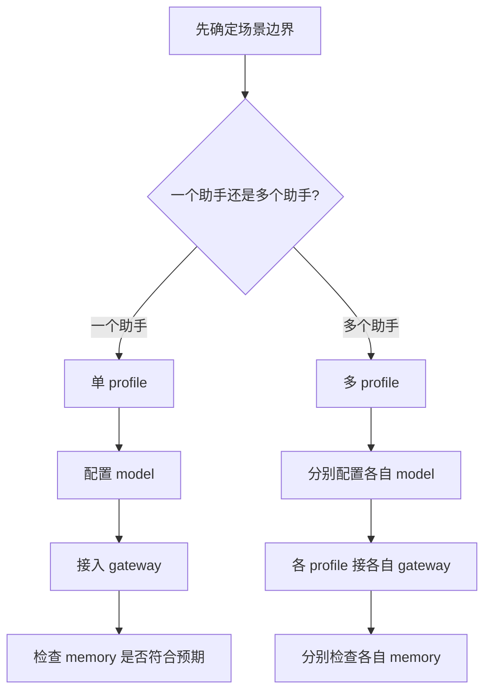

# Hermes 实操入门：profile、gateway、memory 怎么搭

> 这篇笔记解决的不是“概念上它们是什么”，而是“我现在真要把 Hermes 跑起来，profile、gateway、memory 到底该怎么搭”。如果前一篇笔记回答的是**分层关系**，这一篇回答的就是**落地步骤**。

> [!note]
> 本页是 **Hermes 搭建页**，适合在已经理解概念边界之后，按步骤真正落配置。
>
> 建议搭配阅读：
> - [[Hermes 学习笔记——Profile、Personality、Memory 与 Gateway 模型关系]]：先搞清楚边界
> - [[Hermes 排错手册：profile、gateway、memory、model 为什么没按预期工作]]：搭完后行为不符合预期时再看
>
> 它不负责：
> - 证明某个概念为什么这样分层
> - 收集所有故障现象
> - 替代排错页做运行态诊断

## 一、先回答最实际的问题

### 1.1 如果我是第一次搭 Hermes，先搭什么？

先后顺序建议固定成：

```text
先定 profile 边界
-> 再定 model
-> 再接 gateway
-> 最后检查 memory
```

原因很简单：

- `profile` 决定实例边界
- `model` 决定这个实例用什么脑子
- `gateway` 决定从哪里进入这个实例
- `memory` 决定它跨会话记住什么

如果一上来先乱接 gateway，再回头拆 profile，后面往往会把会话、记忆和模型边界搞乱。

### 1.2 一句话总图



这张图适合用 Mermaid，因为这里表达的是**决策流**，结构比视觉装饰更重要。Excalidraw 或生图在这里反而会增加维护成本。

---

## 二、先学会做选择：单 profile 还是双 profile

这是整个搭建过程里最关键的一步。

### 2.1 什么时候用单 profile

适合下面这种目标：

- 微信和 QQ 本质上都在跟“同一个助手”说话
- 希望共享长期记忆
- 希望共享技能与经验
- 接受模型基本统一

结构是：

```text
一个 profile
├── 一个 model 配置
├── 一份 memory
├── 多个 gateway 入口
└── 同一个 Hermes 实例
```

### 2.2 什么时候用双 profile

适合下面这种目标：

- 微信像生活助理，QQ像工作助理
- 两边想用不同模型
- 两边不希望互相污染记忆
- 希望完全隔离会话与技能

结构是：

```text
profile A（wechat）
├── model A
├── memory A
└── gateway A

profile B（qq）
├── model B
├── memory B
└── gateway B
```

### 2.3 实用判断公式

```text
更在乎共享 memory -> 单 profile
更在乎不同 model / 不同边界 -> 多 profile
```

如果你自己都说不清，那就问三句：

1. 我到底要“一个助手”还是“两个助手”？
2. 我更在乎共享记忆，还是模型隔离？
3. 我改的是语气，还是身份边界？

---

## 三、搭建顺序一：先把 profile 搭出来

## 3.1 查看现有 profile

```bash
hermes profile list
```

用途：

- 看当前有哪些 profile
- 避免重名
- 先搞清楚自己现在是在 `default` 里，还是已经有别的 profile

## 3.2 新建 profile

```bash
hermes profile create wechat
hermes profile create qq
```

如果你想从当前配置出发复制一份再改，可以优先查看 `hermes profile create` 的相关参数（例如 clone 类选项）。

Hermes 的 profile 本质上会在下面生成独立空间：

```text
~/.hermes/profiles/<name>/
```

每个 profile 都有自己的：

- `config.yaml`
- `.env`
- `sessions`
- `skills`
- `memory`

## 3.3 切换默认 profile

```bash
hermes profile use wechat
```

这个命令的含义是：

- 把 `wechat` 设为当前默认 profile
- 后续不显式传 `--profile` 时，就默认进入它

## 3.4 查看某个 profile 详情

```bash
hermes profile show wechat
```

用途：

- 确认 profile 是否真的创建成功
- 看它关联的目录与配置状态

## 3.5 不切默认，直接临时指定 profile

```bash
hermes --profile wechat chat
hermes --profile qq chat
```

这是非常重要的习惯。

因为你在做多 profile 调试时，不一定要来回改“全局默认 profile”。很多时候直接用 `--profile` 更安全，也更不容易把配置改串。

---

## 四、搭建顺序二：给每个 profile 配 model

这是第二步，不要颠倒。

### 4.1 最直观方式：交互式选择

```bash
hermes --profile wechat model
hermes --profile qq model
```

适合：

- 想交互式选择 provider / model
- 不想手写配置项

### 4.2 直接改配置

常见命令：

```bash
hermes --profile wechat config set model.default gpt-5.4
hermes --profile wechat config set model.provider custom
hermes --profile wechat config set model.base_url https://ai.klinkw.com/v1

hermes --profile qq config set model.default deepseek-v4-pro
hermes --profile qq config set model.provider custom:deepseek
```

> 具体 provider 名称要以你实际配置的 provider 为准。若不确定，优先走 `hermes model` 交互方式，避免手写错值。

### 4.3 查看当前 profile 的配置文件位置

```bash
hermes --profile wechat config path
hermes --profile qq config path
```

这样做的意义是：

- 确认你改的到底是不是目标 profile
- 避免以为自己改了 `qq`，结果实际改的是 `default`

### 4.4 什么时候需要重启？

配置改完以后：

- CLI：退出重进，或新开会话
- Gateway：`/restart` 或 `hermes gateway restart`

一句话：

> **改完 config，不要假设运行中的 gateway 会自动理解你的新配置。**

---

## 五、搭建顺序三：接 gateway

当 profile 和 model 定好以后，再开始接入口。

## 5.1 首次配置 gateway

```bash
hermes --profile wechat gateway setup
hermes --profile qq gateway setup
```

或在当前默认 profile 下：

```bash
hermes gateway setup
```

它的作用是：

- 配置平台接入
- 写入对应 gateway 所需配置
- 绑定消息入口

## 5.2 启动 gateway（前台）

```bash
hermes --profile wechat gateway run
```

适合：

- 首次调试
- 想直接看报错
- 不想先装成后台服务

## 5.3 安装并启动后台服务

```bash
hermes --profile wechat gateway install
hermes --profile wechat gateway start
```

常用控制命令：

```bash
hermes --profile wechat gateway status
hermes --profile wechat gateway restart
hermes --profile wechat gateway stop
```

如果是双 profile，一般就是两套各自运行。

## 5.4 单 profile 多 gateway 的本质

如果你在一个 profile 里同时接入微信和 QQ，本质是：

```text
同一个 Hermes 实例
<- 微信入口
<- QQ 入口
```

此时默认特征通常是：

- 共用同一个 model 默认配置
- 共用同一份 memory
- 共用同一套 skills

所以不要指望：

- “同一个 profile 里天然按平台永久分不同 model”
- “同一个 profile 里天然按平台自动分不同 memory”

这不是它默认最顺手的用法。

## 5.5 双 profile 双 gateway 的本质

如果你给微信和 QQ 各开一个 profile，本质是：

```text
wechat profile -> wechat gateway -> wechat sessions/memory/model
qq profile     -> qq gateway     -> qq sessions/memory/model
```

这时边界就很清楚。

---

## 六、搭建顺序四：最后检查 memory

很多人把 memory 当成第一步，但其实它应该放在后验检查。

因为 memory 是否“正确”，取决于你前面 profile 是否拆对了。

## 6.1 查看 memory 状态

```bash
hermes --profile wechat memory status
hermes --profile qq memory status
```

关注点：

- memory 是否开启
- user profile 是否开启
- provider 是什么

## 6.2 初始化或配置 memory

```bash
hermes --profile wechat memory setup
hermes --profile qq memory setup
```

常见相关配置在：

- `memory.memory_enabled`
- `memory.user_profile_enabled`
- `memory.provider`

## 6.3 实操上怎么验证 memory 有没有按预期隔离？

最简单的方法不是去猜，而是做实验：

### 单 profile 验证

1. 在微信会话里告诉它一个稳定偏好
2. 换到 QQ 会话问它是否记得
3. 如果是同一 profile，通常应能跨入口延续

### 双 profile 验证

1. 在 `wechat` profile 下告诉它一个稳定偏好
2. 切到 `qq` profile 再问同样问题
3. 如果是双 profile，默认不应自动共享

这才是工程判断，不是脑补。

---

## 七、三种最常见的搭法

## 7.1 搭法 A：一个 profile，多个 gateway

适合：

- 把 Hermes 当一个统一助理
- 需要共享 memory
- 不需要平台级模型隔离

步骤：

```bash
hermes profile use default
hermes model
hermes gateway setup
hermes gateway start
hermes memory status
```

特点：

- 简单
- 共享记忆
- 共享模型
- 容易跨平台延续上下文风格

缺点：

- 平台边界弱
- 生活与工作容易混

## 7.2 搭法 B：微信 / QQ 分 profile

适合：

- 微信生活向
- QQ 工作向
- 模型想独立
- memory 想隔离

步骤示例：

```bash
hermes profile create wechat
hermes profile create qq

hermes --profile wechat model
hermes --profile qq model

hermes --profile wechat gateway setup
hermes --profile qq gateway setup

hermes --profile wechat memory status
hermes --profile qq memory status
```

特点：

- 边界清晰
- 模型清晰
- memory 清晰
- 更适合长期运行

缺点：

- 两套要维护
- 知识不会自动互通

## 7.3 搭法 C：一个 profile + personality 做风格区分

适合：

- 本质还是同一个助手
- 只是想让不同入口的说话风格有所区别

注意：

- `personality` 解决的是表达风格
- 不是实例隔离
- 不是 memory 隔离
- 也不是 model 隔离

因此它不能替代 profile 设计。

---

## 八、推荐给自己的落地方案

如果你以后再为“到底怎么搭”犹豫，可以直接照这个决策表做。

### 8.1 我最在乎共享记忆

就选：**单 profile**

```text
一个 profile
+ 一个 model 主配置
+ 多 gateway
+ 一份 memory
```

### 8.2 我最在乎不同模型与不同边界

就选：**多 profile**

```text
profile A -> model A -> gateway A -> memory A
profile B -> model B -> gateway B -> memory B
```

### 8.3 我最在乎只是语气不同

就选：**同 profile 下调整 personality**

但你必须清楚：

> 这只是风格变化，不是系统边界变化。

---

## 九、命令速查卡

## 9.1 Profile

```bash
hermes profile list
hermes profile create <name>
hermes profile use <name>
hermes profile show <name>
hermes --profile <name> chat
```

## 9.2 Model / Config

```bash
hermes --profile <name> model
hermes --profile <name> config path
hermes --profile <name> config edit
hermes --profile <name> config set model.default <model>
hermes --profile <name> config set model.provider <provider>
```

## 9.3 Gateway

```bash
hermes --profile <name> gateway setup
hermes --profile <name> gateway run
hermes --profile <name> gateway install
hermes --profile <name> gateway start
hermes --profile <name> gateway status
hermes --profile <name> gateway restart
hermes --profile <name> gateway stop
```

## 9.4 Memory

```bash
hermes --profile <name> memory status
hermes --profile <name> memory setup
```

---

## 十、最容易踩的坑

### 坑 1：还没想清楚边界，就先接了一堆 gateway

后果：

- 会话混在一起
- memory 混在一起
- 之后再拆 profile 要返工

### 坑 2：以为 personality 能解决模型隔离

不能。

`personality` 只负责风格，不负责实例边界。

### 坑 3：以为双 profile 还能天然共用 memory

默认不会。

profile 隔离的意义，本来就包括 memory 隔离。

### 坑 4：改完配置不重启 gateway

后果：

- 你以为新配置没生效
- 实际只是旧进程还在跑旧配置

### 坑 5：用错 profile 改配置

所以养成习惯：

```bash
hermes --profile <name> config path
```

先看路径，再动手。

---

## 十一、我的推荐搭法（面向大多数个人用户）

### 场景 1：只是想把 Hermes 当统一私人助理

推荐：

- 一个 profile
- 一个主模型
- 多 gateway
- 开 memory

### 场景 2：想把生活和工作严格分开

推荐：

- `wechat` profile
- `qq` profile
- 各自独立模型
- 各自独立 memory
- 各自独立 gateway

### 场景 3：现在还不确定自己要哪种

推荐先从：

- **单 profile 起步**

等你发现：

- memory 污染明显
- 模型需求分化明显
- 两边角色真的不同

再拆成多 profile。这样迁移成本最低。

---

## 十二、一句话收束

> **Hermes 实操搭建的核心不是“先把功能全开”，而是先把边界定清楚。profile 定边界，gateway 接入口，memory 跟着 profile 走；你真正要做的，是先决定自己要的是一个助手，还是多个助手。**

## 相关笔记

- [[Hermes 学习笔记——Profile、Personality、Memory 与 Gateway 模型关系]]
- [[外部知识库/README|learn-agent 外部知识库]]（相关主题：OpenClaw、Hermes 和 Harness）
- [[Agent与自动化/AI Agent 自动化任务方案对比|AI Agent 自动化任务方案对比]]
