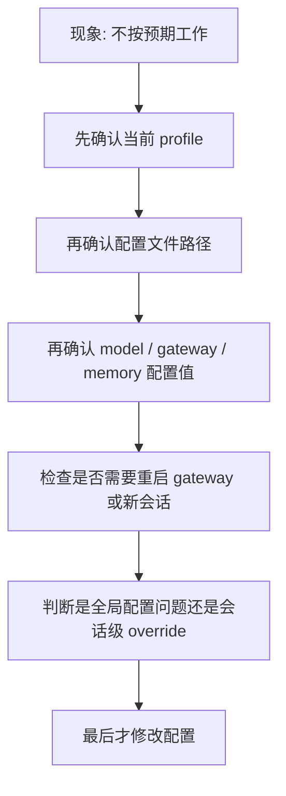

# Hermes 排错手册：profile、gateway、memory、model 为什么没按预期工作

> 这篇笔记不是讲“怎么搭”，而是讲“为什么你明明搭了，却没按你想的那样工作”。Hermes 相关问题最常见的错，不是命令不会敲，而是**边界理解错、改错 profile、改完没重启、把 personality 当成 profile、把会话级 override 当成平台级规则**。

> [!warning]
> 本页是 **Hermes 排错页**，默认前提是你已经有一套配置，并且遇到了“行为和预期不一致”的问题。
>
> 如果你还在前置阶段，先回到：
> - [[Hermes 学习笔记——Profile、Personality、Memory 与 Gateway 模型关系]]：先理解边界
> - [[Hermes 实操入门：profile、gateway、memory 怎么搭]]：先按顺序搭起来
>
> 它不负责重新解释 Hermes 的整体概念模型，也不适合作为第一次接触 Hermes 的入口页。

## 一、先学会一种排错顺序

遇到 Hermes 不按预期工作时，先不要乱改。先按下面顺序检查：



这张图适合 Mermaid，因为这里表达的是**排错流程**，结构关系清楚最重要；没有必要上 Excalidraw 或生图。

---

## 二、先分清四类故障

Hermes 的问题大多数可以归到下面四类：

### 2.1 Profile 问题

表现：

- 你以为自己在改 `wechat`，其实改的是 `default`
- 你以为某个 memory 应该隔离，结果它本来就是同一个 profile
- 你以为某个 gateway 属于 A profile，实际上它跑在 B profile

### 2.2 Config / Model 问题

表现：

- 改了 `model.default` 但回复模型没变
- 改了 provider 但请求仍走旧 provider
- 改了 base_url 但结果看起来像还是旧端点

### 2.3 Gateway 运行态问题

表现：

- 配置写对了，但 gateway 还在用旧配置
- gateway 根本没启动成功
- 多个 gateway / 多个 profile 的运行实例搞混了

### 2.4 Memory 预期问题

表现：

- 你以为它该共享，但它没共享
- 你以为它不该共享，但它共享了
- 你以为是 memory 问题，其实是 profile 边界问题

---

## 三、第一件事：先确认你现在到底在哪个 profile

这是第一优先级，没有之一。

## 3.1 常用命令

```bash
hermes profile list
hermes profile show <name>
hermes --profile <name> config path
```

## 3.2 最容易犯的错

### 错误：改错 profile

比如你以为自己在改 `qq`：

```bash
hermes config set model.default deepseek-v4-pro
```

但如果你当前默认 profile 其实还是 `default`，那你改掉的就是 `default`，不是 `qq`。

### 正确做法

除非你 100% 确定当前默认 profile，否则排错时一律显式写：

```bash
hermes --profile qq config path
hermes --profile qq config edit
hermes --profile qq config set model.default deepseek-v4-pro
```

### 判断原则

> **排错时，宁可啰嗦写 `--profile`，也别靠记忆猜。**

---

## 四、第二件事：先看配置路径，再看配置内容

## 4.1 先看路径

```bash
hermes --profile wechat config path
hermes --profile qq config path
```

你要确认：

- 目标 profile 的配置文件是否真存在
- 你接下来看的，是不是同一份文件

## 4.2 再看内容

```bash
hermes --profile wechat config
```

或者直接：

```bash
hermes --profile wechat config edit
```

重点检查这些字段：

```yaml
model:
  default:
  provider:
  base_url:
  api_key:

memory:
  memory_enabled:
  user_profile_enabled:
  provider:
```

还有 gateway 相关配置是否写在了正确 profile 里。

---

## 五、典型故障一：为什么 gateway 还在用旧模型？

这是最常见的一类。

### 5.1 现象

- 你改了 `model.default`
- 你很确定文件里已经是新值
- 但 gateway 回复出来看起来还是旧模型风格/旧供应商行为

### 5.2 第一怀疑：gateway 没重启

Hermes 的运行中 gateway 不会自动热更新所有配置。

先做：

```bash
hermes --profile wechat gateway restart
```

或者在 gateway 内：

```text
/restart
```

### 5.3 第二怀疑：你改的是错的 profile

再做一遍：

```bash
hermes --profile wechat config path
hermes --profile wechat config
```

确认不是改到了 `default` 或别的 profile。

### 5.4 第三怀疑：会话级 model override 还在生效

这是很多人忽略的点。

Hermes gateway 支持会话级 `/model` 切换。也就是说：

- 即使全局配置改了
- 某个会话仍可能暂时记着它之前切过去的模型

### 5.5 排错动作

按顺序做：

1. 确认 profile 正确
2. 确认 config 已改
3. restart gateway
4. 开一个**新会话**再测试
5. 如果旧会话异常，新会话正常，说明很可能是会话级 override，不是全局配置失效

### 5.6 一句话结论

> **改了 model 没生效，先别怀疑 Hermes 代码，先怀疑自己改错 profile、没重启 gateway，或者旧会话里还有 override。**

---

## 六、典型故障二：为什么微信和 QQ 没按我想的那样分模型？

### 6.1 现象 A：我希望微信一个模型、QQ一个模型，但它们都在用同一个

这通常不是 bug，而是设计理解错了。

如果微信和 QQ 都挂在**同一个 profile** 里，那么默认预期就是：

- 共用同一个全局 model 配置
- 共用同一个 memory
- 共用同一个 skill 空间

所以这个结果**往往是符合设计的**，不是故障。

### 6.2 正确判断

先问自己：

- 我是不是把两边都放在同一个 profile 里了？

如果答案是“是”，那它们默认共用模型，本来就正常。

### 6.3 解决方案

如果你真正要的是：

- 微信独立模型
- QQ独立模型

那就应该改架构，不是改一个小配置：

```text
wechat -> profile wechat -> model A
qq     -> profile qq     -> model B
```

### 6.4 现象 B：我已经拆成双 profile 了，但看起来还是像同一个模型

这时再查：

```bash
hermes --profile wechat config path
hermes --profile wechat config
hermes --profile qq config path
hermes --profile qq config
```

再分别重启：

```bash
hermes --profile wechat gateway restart
hermes --profile qq gateway restart
```

如果还不对，再检查是否其实只有一个 gateway 在跑，另一个没成功启动。

---

## 七、典型故障三：为什么 memory 没共享 / 反而共享了？

这类问题本质上几乎都不是 memory 本身的问题，而是**边界判断问题**。

## 7.1 现象 A：我以为微信和 QQ 应该共享记忆，但它们没有

先检查：

- 微信和 QQ 是不是分别挂在两个不同 profile？

如果是，那么**默认不共享 memory** 才是正常现象。

### 正确理解

Hermes 的 profile 隔离本来就包括：

- config 隔离
- sessions 隔离
- skills 隔离
- memory 隔离

所以：

> **双 profile 不共享 memory，默认是正常，不是故障。**

## 7.2 现象 B：我以为它们不该共享，但它们共享了

先检查：

- 两个平台是不是其实还在同一个 profile 下？

如果是，那共享 memory 通常才是正常的。

### 典型误解

很多人以为：

- 微信一个 personality
- QQ 一个 personality

就等于它们分开了。错。

`personality` 只改风格，不改实例边界。

## 7.3 如何验证 memory 是否按预期工作

### 单 profile 验证法

1. 在微信会话里告诉它一个稳定偏好
2. 切到 QQ 会话问它是否记得
3. 如果是同一 profile，通常应能延续

### 双 profile 验证法

1. 在 `wechat` profile 里提供一个稳定偏好
2. 切到 `qq` profile 再问
3. 如果双 profile 默认还互相知道，那才值得继续排查

### 常用命令

```bash
hermes --profile wechat memory status
hermes --profile qq memory status
```

重点看：

- memory 是否启用
- user_profile 是否启用
- provider 是否正常

---

## 八、典型故障四：为什么 personality 改了，但感觉没变化？

### 8.1 第一种可能：你改的是风格，但期待的是边界变化

这是认知错误，不是系统错误。

你改 `personality` 后，它影响的是：

- system prompt
- 说话风格
- 语气表达

它不影响：

- model 隔离
- memory 隔离
- profile 边界

所以如果你期待“微信 / QQ 从此像两个完全不同的实例”，那改 personality 本来就不够。

### 8.2 第二种可能：旧会话上下文很重

即使 personality 改了，如果你还在一个很长、很重的旧会话里测试，表现变化可能不明显。

### 排错动作

- 新开一个会话测试
- 不要在污染很重的旧会话里判断 personality 是否生效

### 8.3 第三种可能：你看的是 display.personality，但真正影响行为的是 agent.system_prompt

要注意：

- 某些配置项更偏显示层
- 真正影响代理行为的，仍然是 system prompt 及其运行态加载结果

因此排错时应重点关注：

- personality 是否真的写进相关 prompt 配置
- 新会话里是否重新加载

---

## 九、典型故障五：为什么我明明改了 config，但“像没改一样”？

这类问题往往有三个根因。

## 9.1 根因一：改错文件 / 改错 profile

检查：

```bash
hermes --profile <name> config path
```

## 9.2 根因二：运行中的进程没重启

检查并执行：

```bash
hermes --profile <name> gateway restart
```

CLI 场景则直接退出重进。

## 9.3 根因三：你在旧会话里测试新配置

注意：

- 新配置未必会完整覆盖旧会话的所有运行态
- 尤其是 model override / personality / prompt 相关效果，最好在新会话验证

### 最稳妥的排错顺序

```text
改 config
-> restart gateway / 重开 CLI
-> 开新会话
-> 再测试
```

如果这样仍不对，再怀疑更深层问题。

---

## 十、典型故障六：gateway 根本没正常跑起来

这时不要猜，直接查状态。

## 10.1 基础检查

```bash
hermes --profile wechat gateway status
```

如果状态异常，再看日志。

## 10.2 日志检查

Hermes 文档给出的典型日志路径是：

```text
~/.hermes/logs/gateway.log
```

可做类似检查：

```bash
grep -i "failed to send\|error" ~/.hermes/logs/gateway.log | tail -20
```

### 常见含义

- 启动失败：平台配置不完整
- 连接失败：凭证或平台侧配置有问题
- 发送失败：目标 chat/channel 或 API 调用有问题

### 关键原则

> **运行态问题优先看 `gateway status` 和日志，不要只盯着 config 猜。**

---

## 十一、一个实用的排错总表

| 现象 | 最可能根因 | 第一动作 |
|---|---|---|
| 改了模型没生效 | 没重启 / 改错 profile / 旧会话 override | `config path` → `gateway restart` → 新会话 |
| 微信和 QQ 还是同模型 | 仍在同一 profile | 先确认 profile 架构 |
| memory 没共享 | 其实是双 profile | 检查 profile 边界 |
| memory 反而共享 | 其实还在同一 profile | 检查 gateway 是否共用同实例 |
| personality 改了没感觉 | 旧会话太重 / 期待错层级 | 新会话测试，别拿它当 profile |
| 改了 config 像没改 | 没重启 / 改错文件 | `config path` + 重启 |
| gateway 不工作 | 运行态故障 | `gateway status` + 日志 |

---

## 十二、推荐给自己的排错习惯

### 习惯 1：排错时一律显式写 `--profile`

别偷懒。偷懒最容易改串。

### 习惯 2：先看 `config path`，再谈配置

别在不知道自己改哪份文件的情况下讨论“为什么没生效”。

### 习惯 3：先重启，再下结论

很多所谓“配置失效”，其实只是旧进程没重启。

### 习惯 4：新会话验证，而不是旧会话脑补

尤其涉及：

- model
- personality
- prompt
- override

### 习惯 5：先判断是不是设计预期，再判断是不是 bug

比如：

- 双 profile 不共享 memory
- 单 profile 下多 gateway 共用默认模型

这些往往不是故障，而是正确行为。

---

## 十三、一句话总收束

> **Hermes 大多数“没按预期工作”的问题，不是功能坏了，而是你把 profile、gateway、memory、model 的边界理解错了。排错时先查 profile，再查 config path，再查运行态，再查旧会话 override，最后才怀疑系统本身。**

## 相关笔记

- [[Hermes 学习笔记——Profile、Personality、Memory 与 Gateway 模型关系]]
- [[Hermes 实操入门：profile、gateway、memory 怎么搭]]
- [[ai相关/learn-agent/概念介绍/05.OpenClaw、Hermes和Harness关系|OpenClaw、Hermes 和 Harness：它们到底是什么关系]]
- [[Agent与自动化/AI Agent 自动化任务方案对比|AI Agent 自动化任务方案对比]]
