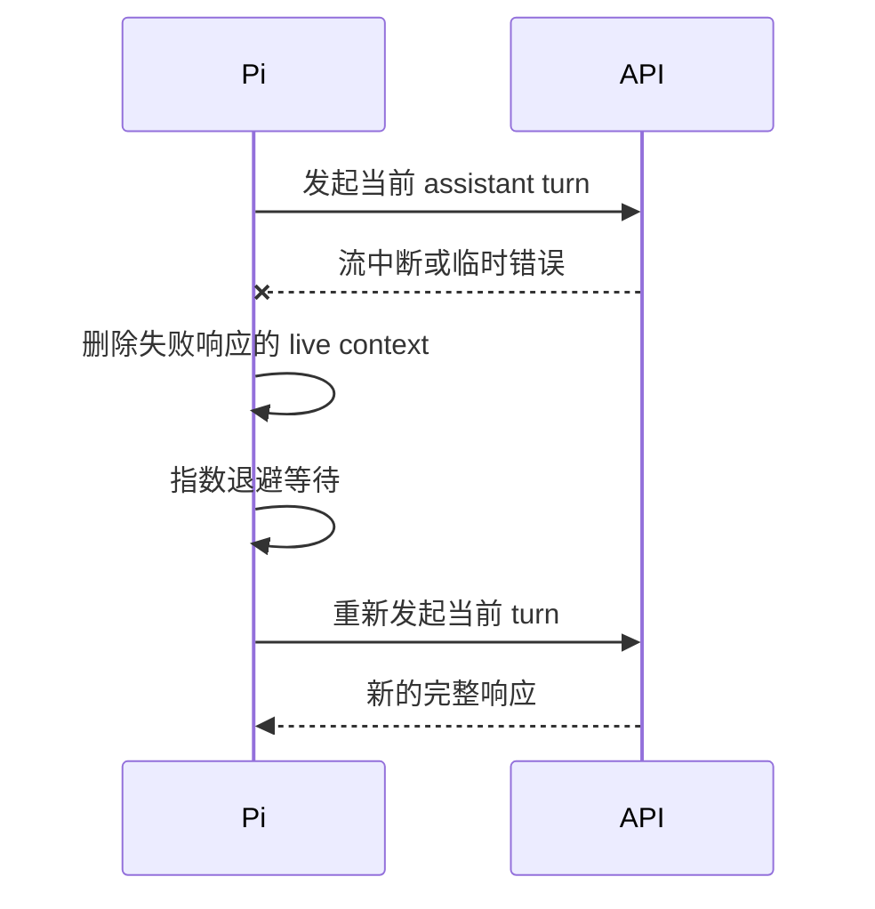

# PI Agent 自动重试与网络中断恢复

## 结论

在 pi 0.84.2 中，agent 级自动重试默认开启。遇到可识别的临时网络、限流或服务端故障时，pi 会按指数退避重新请求。

默认配置：

```json
{
  "retry": {
    "enabled": true,
    "maxRetries": 3,
    "baseDelayMs": 2000,
    "provider": {
      "maxRetries": 0,
      "maxRetryDelayMs": 60000
    }
  }
}
```

三次重试的等待时间约为 `2s -> 4s -> 8s`。TUI 会显示 `Retrying (1/3) in 2s...`，等待期间可按 `Esc` 取消。

## 什么错误会重试

常见可重试信号包括：

- `429`、rate limit、too many requests
- `500`、`502`、`503`、`504`、`524`
- overloaded、service unavailable、server error
- `fetch failed`、DNS 临时失败、connection refused/lost
- socket hang up、connection reset、terminated
- request timeout、stream idle timeout
- WebSocket closed/error
- 流在终止事件之前异常结束

pi 的判断依赖最终 assistant message 的 `stopReason === "error"` 和 `errorMessage` 模式匹配。自定义 API 如果返回完全不同的错误文案，可能不会被识别为临时错误。

## 重试不等于断点续传

重试流程通常是：



> [!important]
> 这不是在旧连接上 reconnect 后从中断 token 继续。中断前的未完成文本可能被重新生成，措辞甚至工具选择可能变化。

已经完成并写入 session 的用户消息、历史回答和工具结果仍然保留；失败的 assistant 响应会保存在 session 历史中供审计，但不会作为正常回答继续进入重试上下文。

## 通常不会重试的情况

- 用户主动中止
- 认证、请求参数等确定性错误
- billing、insufficient quota、quota exceeded
- 自定义 provider 的错误文案不匹配临时故障模式
- pi 进程退出或整个终端会话中断
- context overflow：它走自动 compaction 与一次恢复重试，而不是普通网络重试

## Agent 级与 Provider 级重试

| 层级 | 默认 | 特点 |
|---|---:|---|
| Agent 级 `retry.maxRetries` | 3 | pi 能显示倒计时、取消、判断最终失败并重建当前 turn |
| Provider/SDK 级 `retry.provider.maxRetries` | 0 | 发生在 SDK 内部，可能延长不可见等待，并与 agent 级重试叠加 |

实践中优先调整 agent 级重试。只有明确了解 provider SDK 行为时，再提高 provider 级次数。

## 网络不稳定时的配置建议

```json
{
  "retry": {
    "enabled": true,
    "maxRetries": 5,
    "baseDelayMs": 2000,
    "provider": {
      "maxRetries": 0,
      "maxRetryDelayMs": 60000
    }
  },
  "httpIdleTimeoutMs": 300000,
  "websocketConnectTimeoutMs": 15000
}
```

不要只为了“更稳”无限增加超时和重试次数。持续故障会被放大成长时间阻塞，也可能重复触发非幂等的模型决策。

## 相关笔记

- [[PI Agent 模型上下文窗口配置]]
- [[PI Agent 上下文占用计算与诊断]]

## 本机依据

- pi 版本：`0.84.2`
- 官方设置文档：`@earendil-works/pi-coding-agent/docs/settings.md`
- RPC 事件文档：`@earendil-works/pi-coding-agent/docs/rpc.md`
- 重试实现：`dist/core/agent-session.js` 与 `@earendil-works/pi-ai/dist/utils/retry.js`
