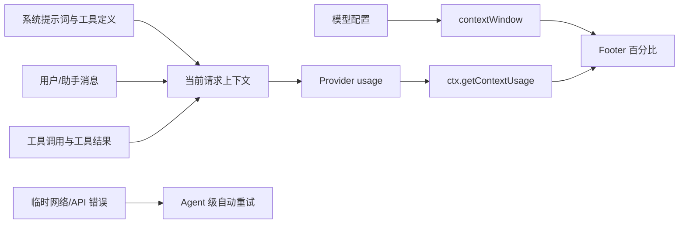

# PI Agent 学习

本目录记录 PI Agent 的运行机制、配置方法和扩展开发经验。当前内容基于本机安装的 **pi 0.84.2** 官方文档、安装包实现及一次真实会话观察。

> [!warning] 版本边界
> PI 仍在演进。这里的默认值、配置字段和扩展 API 都应结合实际安装版本复核，不要把实验观察当成跨版本承诺。

## 建议阅读顺序

1. [[PI Agent 自动重试与网络中断恢复]]：理解 API 不稳定时 pi 会怎样处理。
2. [[PI Agent 模型上下文窗口配置]]：理解 `contextWindow`、`maxTokens` 和 provider 配置。
3. [[PI Agent 上下文占用计算与诊断]]：理解 footer 百分比为何变化，以及如何定位大项。
4. [[PI Agent 上下文归因插件设计]]：把一次性诊断方法固化为扩展。

## 核心心智模型

## 一句话结论

- pi 默认会对可识别的临时网络或 provider 错误自动重试。
- 重试通常是重新发起当前 assistant turn，不是从断流位置续传。
- `contextWindow` 是输入与输出共享的总窗口；`maxTokens` 是单次最大输出。
- footer 百分比约等于“当前上下文 token / 当前模型窗口”。缩小窗口会让百分比立即升高。
- 工具返回会进入后续模型上下文；完整文档和宽泛搜索结果经常是占用突增主因。
- 扩展能做精确总量加估算归因，但 provider 通常不给逐消息精确 token。

## 内容属性

- **官方机制**：来自本机 pi 0.84.2 的 `docs/` 和公开扩展 API。
- **实验观察**：来自 session `01a00f83-f825-78e1-b2ae-bb1c62148914` 的 usage 记录。
- **设计建议**：上下文归因插件的实现方案，尚未实现。
