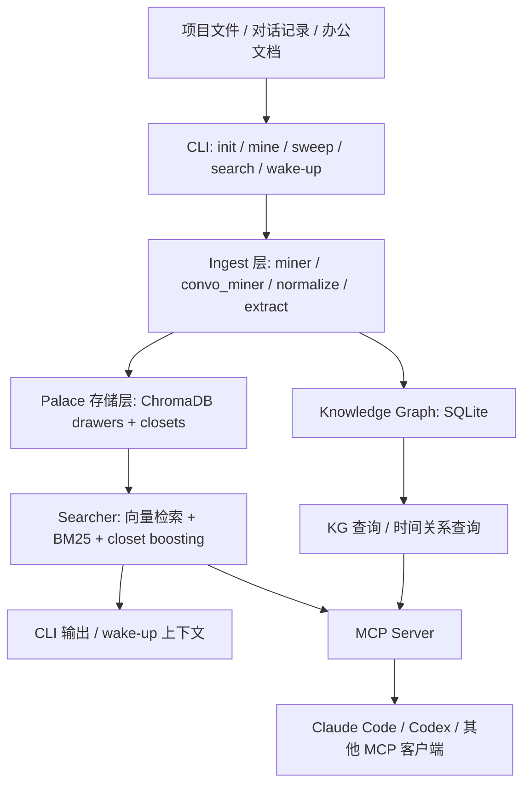

# MemPalace 学习笔记

> 基于 2026-05-25 拉取的 [MemPalace/mempalace](https://github.com/MemPalace/mempalace) 仓库内容整理。

---

## 一、一句话理解

**MemPalace** 是一个面向 AI Agent 的**本地优先长期记忆层**：把项目文件、对话记录、文档原文按结构存进本地“记忆宫殿”，再通过语义检索、关键词检索、知识图谱和 MCP 工具把这些记忆重新提供给 Agent 使用。

它最重要的主张不是“帮你总结记忆”，而是：

> **先把原文保存下来，再尽量准确地找回来。**

---

## 二、它到底在解决什么问题

大模型在真实开发或长期协作里，常见有四个问题：

1. **上下文窗口有限**：历史太长以后，旧信息会丢。
2. **会话易失**：像 Claude Code 这类工具，历史会话和上下文压缩后不一定还能方便找回。
3. **靠摘要容易失真**：很多“记忆系统”喜欢先抽取、总结、改写，但一旦总结错了，后面就会一路带偏。
4. **项目记忆与对话记忆是割裂的**：代码、文档、聊天记录、决策记录往往分散在不同地方。

MemPalace 的解法比较朴素但很工程化：

- **不先总结，先存原文**
- **统一存项目、对话、文档三类内容**
- **用分层结构和检索增强来找回**
- **默认本地运行，不依赖云端 API**

---

## 三、核心概念

MemPalace 用“宫殿”隐喻整个记忆系统，几个核心对象要先记住：

| 概念 | 含义 | 我的理解 |
|---|---|---|
| **Palace** | 整个记忆库 | 总仓库 |
| **Wing** | 大分区 | 通常对应人、项目、主题域 |
| **Room** | 小分区 | 某个子主题、模块、目录类型 |
| **Drawer** | 最小记忆单元 | 真正存下来的原文块 |
| **Closet** | 辅助检索索引层 | 给 drawer 建“主题指针” |
| **Hall / Hallway** | 主题通路 | 跨房间、跨分区导航线索 |
| **Knowledge Graph** | 结构化实体关系图 | 补足“谁和谁什么关系、什么时候有效” |

一句话就是：

**drawer 存原文，closet 帮检索，knowledge graph 补结构化关系。**

---

## 四、项目定位与能力边界

### 4.1 它不是什么

- 不是单纯的聊天记录备份工具
- 不是只服务某一个模型厂商的插件
- 不是传统意义上“先抽取摘要再喂给模型”的记忆框架

### 4.2 它是什么

- 一个 **CLI 工具**
- 一个 **本地向量记忆库**
- 一个 **MCP Server**
- 一个 **面向 Agent 的 memory runtime 组件**

从 README 和代码结构看，它更像是 AI coding agent 生态里的“基础设施件”，和 [[AI Harness（驾驭层）知识手册]] 里说的 harness/memory 层非常接近。

---

## 五、整体架构



---

## 六、我读下来最关键的设计点

## 6.1 原文优先，不先摘要

README 里写得很明确：它**不会先 summarise / extract / paraphrase**，而是先做 verbatim storage。

这件事很重要，因为很多记忆系统的误差就出在：

- 把长对话总结成几条 bullet
- 把语气、上下文、限定条件抹平
- 后续模型再把“摘要”当“事实”

MemPalace 的思路是：**记忆系统第一职责是保真，不是抢先解释。**

## 6.2 项目文件、对话、文档走统一记忆库

`cli.py` 里把三类 ingest 方式统一到了同一个 CLI：

- `mempalace mine <dir>`：项目文件
- `mempalace mine <dir> --mode convos`：对话记录
- `mempalace mine <dir> --mode extract`：PDF / DOCX / PPTX / XLSX / RTF / EPUB

这意味着它不是“只记聊天”，而是在做**工作全过程的记忆归档**。

## 6.3 检索不是纯向量，而是 hybrid

`searcher.py` 里很清楚地写了：

- drawer 直接查询是**保底路径**
- closet 命中只作为**加分信号**
- 排序结合了 **vector similarity + BM25**

这个设计很稳：

- 纯向量检索容易语义相近但细节不准
- 纯关键词检索容易漏同义表达
- closet 只加权不设门槛，能避免辅助索引把真实结果“挡住”

## 6.4 存储后端可插拔

`pyproject.toml` 暴露了：

```toml
[project.entry-points."mempalace.backends"]
chroma = "mempalace.backends.chroma:ChromaBackend"
```

再配合 `mempalace/backends/base.py` 的抽象接口，可以看出作者不想把系统永远绑死在 ChromaDB 上，而是提前抽了 backend contract。

这说明项目已经不是“脚本集合”，而是在往**框架化**方向走。

## 6.5 用 SQLite 做本地知识图谱

`knowledge_graph.py` 很值得注意：

- 不是 Neo4j
- 不是云服务
- 直接用本地 SQLite
- 支持 `valid_from` / `valid_to`
- 能做 **temporal query**

也就是说，MemPalace 不只是“搜文本”，还开始补：

- 某个事实何时成立
- 关系什么时候失效
- 某个实体在某个时间点的状态

这是从“记忆检索”往“记忆推理结构”迈的一步。

## 6.6 很强的工程防御意识

这个仓库有个我挺喜欢的气质：**非常在意坏场景。**

从代码里能明显看到作者在处理很多真实使用中的脏问题：

- `mcp_server.py` 先保护 stdio，防止依赖库往 stdout 乱打印把 MCP JSON-RPC 冲坏
- `config.py` 对名字、日期、内容长度做校验
- `chroma.py` 里大量处理 HNSW 索引损坏、异常膨胀、元数据缺失
- `miner.py` / `convo_miner.py` 处理超大文件、空文件、重复挖掘、分块上限

这类代码通常说明：项目已经经历过不少真实用户环境，而不只是“跑得起来”的 demo。

---

## 七、代码结构速读

### 7.1 入口与配置

| 文件 | 作用 |
|---|---|
| `mempalace/cli.py` | CLI 主入口，所有子命令从这里分发 |
| `mempalace/config.py` | 全局配置、环境变量优先级、输入校验 |
| `mempalace/__main__.py` | Python 模块执行入口 |

### 7.2 存储层

| 文件 | 作用 |
|---|---|
| `mempalace/backends/base.py` | 存储后端抽象接口 |
| `mempalace/backends/chroma.py` | ChromaDB 参考实现 |
| `mempalace/palace.py` | palace 级共享操作、collection 打开、closet 构建等 |

### 7.3 数据摄取层

| 文件 | 作用 |
|---|---|
| `mempalace/miner.py` | 项目文件挖掘 |
| `mempalace/convo_miner.py` | 对话记录挖掘 |
| `mempalace/normalize.py` | 多种聊天格式归一化 |
| `mempalace/diary_ingest.py` | diary 类内容摄取 |
| `mempalace/sweeper.py` | 对 transcript 进一步扫成逐消息 drawer |

### 7.4 检索与记忆使用层

| 文件 | 作用 |
|---|---|
| `mempalace/searcher.py` | 混合检索排序 |
| `mempalace/layers.py` | 记忆分层（L0/L1/L2/L3） |
| `mempalace/closet_llm.py` | closet 相关 LLM 处理 |
| `mempalace/wake-up` 相关命令实现 | 新会话上下文恢复 |

### 7.5 Agent 集成层

| 文件 | 作用 |
|---|---|
| `mempalace/mcp_server.py` | MCP Server 主实现 |
| `hooks/` | 自动保存与压缩前保存 |
| `.codex-plugin/` | Codex 插件支持 |
| `.claude-plugin/` | Claude Code 插件支持 |

### 7.6 图谱与结构化记忆

| 文件 | 作用 |
|---|---|
| `mempalace/knowledge_graph.py` | 实体关系图谱，带时间有效期 |
| `mempalace/palace_graph.py` | 房间/通道导航图 |
| `mempalace/entity_detector.py` | 实体检测 |
| `mempalace/entity_registry.py` | 实体注册表 |

---

## 八、CLI 子命令一眼看懂

我从 `cli.py` 里看到的主要子命令有：

- `init`
- `mine`
- `sweep`
- `sync`
- `search`
- `compress`
- `wake-up`
- `split`
- `hook`
- `instructions`
- `repair`
- `mcp`
- `onboarding`
- `status`
- `migrate`

可以把它们粗分成四组：

| 类别 | 命令 |
|---|---|
| 初始化 | `init` `onboarding` `migrate` |
| 摄取 | `mine` `sweep` `split` `sync` |
| 取回 | `search` `wake-up` `status` |
| 运维 | `repair` `hook` `instructions` `mcp` |

这也说明 MemPalace 不只是一个 search 工具，而是一整套“记忆生命周期”工具链。

---

## 九、典型工作流

## 9.1 项目记忆

```bash
mempalace init ~/projects/myapp
mempalace mine ~/projects/myapp
mempalace search "why did we switch to GraphQL"
```

适合把：

- 代码
- 设计文档
- 会议记录
- 决策说明

都放进同一个项目 wing。

## 9.2 对话记忆

```bash
mempalace mine ~/.claude/projects/ --mode convos
mempalace wake-up
```

适合把 AI 编码助手的历史会话做持久化，下一次开新会话时快速“叫醒”上下文。

## 9.3 更细粒度的消息回收

README 提到：

```bash
mempalace sweep <transcript-dir>
```

这个命令会把 transcript 进一步拆成**逐条 user/assistant message** 的 verbatim drawer，适合想做更细粒度检索的人。

---

## 十、性能与 benchmark 怎么看

README 给出的 benchmark 很亮眼，尤其是：

- LongMemEval raw R@5 = **96.6%**
- Hybrid v4 held-out R@5 = **98.4%**
- Hybrid + LLM rerank = **>=99%**

但这里有两个学习时要注意的点：

1. 这是仓库作者给出的**项目自报成绩**，可以参考，但最好配合 `benchmarks/README.md` 自己理解复现方式。
2. 它强调的是 **retrieval recall**，不是完整问答系统的最终正确率。

也就是说，MemPalace 的强项更像：

> “把对的上下文捞出来”

而不是：

> “替你直接生成绝对正确的最终答案”

这个边界要分清。

---

## 十一、我认为这个项目最值得学的地方

## 11.1 记忆系统的“保真优先”哲学

很多人做 Agent memory 会直接冲向“更聪明的摘要”。  
MemPalace 提醒了一件更基础的事：

> **先把原始证据保住。**

这对做长期协作型 Agent 特别重要。

## 11.2 从工具到基础设施的演化路径

这个仓库已经有明显的基础设施形态：

- CLI
- MCP Server
- 插件目录
- hooks
- backend 抽象
- benchmarks
- tests

很适合拿来学习“一个 AI 工具如何逐渐长成平台组件”。

## 11.3 工程上对失败模式的重视

如果你在学 AI 应用开发，这仓库比单纯看 prompt 工程更有价值，因为它大量展示了：

- 如何处理坏数据
- 如何控制本地依赖副作用
- 如何保护长会话与索引一致性
- 如何为 Agent 系统补恢复、修复、迁移能力

这部分正好能和 [[AI Harness（驾驭层）知识手册]] 对起来看。

---

## 十二、阅读源码的推荐顺序

> [!tip]
> 如果你想真正“吃透”这个项目，我建议按“先骨架、后路径、再细节”的顺序读。

### 第一轮：先看全局定位

1. `README.md`
2. `pyproject.toml`
3. `mempalace/README.md`
4. `benchmarks/README.md`

目标：知道它做什么、怎么装、怎么跑、对外宣称什么能力。

### 第二轮：看主干调用链

1. `mempalace/cli.py`
2. `mempalace/config.py`
3. `mempalace/palace.py`
4. `mempalace/backends/base.py`
5. `mempalace/backends/chroma.py`

目标：知道命令怎么进、配置怎么传、数据最终落到哪里。

### 第三轮：看两条核心路径

#### 路径 A：写入

`miner.py` / `convo_miner.py`  
看它如何：

- 扫文件
- 过滤文件
- 归一化内容
- 分块
- 去重
- 入库

#### 路径 B：读取

`searcher.py` / `layers.py`

看它如何：

- 查询 drawer
- 做 BM25 重排
- 利用 closet 提示
- 组装 wake-up 上下文

### 第四轮：看高级能力

1. `knowledge_graph.py`
2. `mcp_server.py`
3. `hooks/`
4. `normalize.py`
5. `entity_detector.py`

目标：理解它如何从“检索工具”升级成“Agent memory runtime”。

---

## 十三、如果你想本地上手，最短路径是这样

```bash
git clone https://github.com/MemPalace/mempalace.git
cd mempalace
uv sync --extra dev
pytest
python -m mempalace --help
```

如果是按工具方式安装：

```bash
uv tool install mempalace
mempalace init ~/projects/myapp
mempalace mine ~/projects/myapp
mempalace search "关键词"
```

如果你的兴趣点是“给 AI 编码工具做长期记忆”，那优先看：

1. `mcp_server.py`
2. `hooks/README.md`
3. `.codex-plugin/README.md`
4. `.claude-plugin/README.md`

---

## 十四、我自己的几个观察

### 14.1 这是“memory layer”，不是完整 agent framework

它很强，但主要强在**记忆**，不是完整的任务编排系统。  
所以它更像 Agent 体系里的一个关键部件，而不是全部。

### 14.2 仓库已经有明显的平台化野心

从这些东西能看出来：

- backend entry points
- MCP tools
- plugin 目录
- hooks
- source adapter 预留位

它未来很可能会继续往“跨客户端、跨数据源的记忆基础设施”方向走。

### 14.3 文档与代码注释存在轻微不同步

我看到一个小细节：

- README 对外写的是 **29 MCP tools**
- `mcp_server.py` 顶部注释里仍写 **19 tools**

这大概率不是功能矛盾，而是仓库在快速迭代时，局部注释没完全同步更新。读这类项目时要习惯：

> **以当前实现和测试为准，README 为总览，模块注释可能稍旧。**

---

## 十五、可以和哪些笔记联动着看

- [[AI Harness（驾驭层）知识手册]] — 从“记忆层”理解 harness
- [[ECC（Everything Claude Code）知识手册]] — 对比 ECC 这种偏工作流增强的 agent harness
- [[Claude Code Skills 与 MCP 精华笔记]] — 理解 MCP 在 Agent 生态里的位置

---

## 十六、后续可继续深挖的问题

1. `wake-up` 具体如何组装 L0/L1/L2 上下文？
2. `layers.py` 的分层召回策略是否适合中文语料？
3. `normalize.py` 对不同聊天格式的抽象边界在哪里？
4. Chroma 之外的新 backend 要实现哪些最小接口？
5. knowledge graph 和原文 drawer 的协同检索是否已经足够紧密？

---

## 十七、总结

如果只用一句话概括我目前的理解：

> **MemPalace 是一个把“AI 长期记忆”从想法做成工程系统的项目。**

它最有价值的不是某一个 benchmark 数字，而是它把下面这些事情放在了一起：

- 原文保真
- 统一摄取
- 混合检索
- 本地知识图谱
- MCP 接入
- 自动保存
- 修复与迁移

所以它很适合拿来学习：

1. **AI Agent 的 memory layer 怎么设计**
2. **本地优先 AI 工具怎么做工程防护**
3. **一个 AI 项目如何从脚本进化成可复用基础设施**
